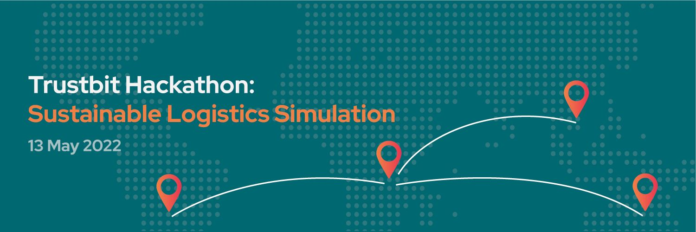

  

  <h4 align="center">This is the <b>Python</b> agent template repository for the  <a href="https://trustbit.tech/hackathon" target="_blank">Trustbit Hackathon: Sustainable Logistics Simulation</a> which you can use to get started quickly.</h4>

  

    <a href="LICENSE"></img></a>
        <a href="https://trustbit.tech"></img></a>
    <a href="https://join.slack.com/t/trustbitsusta-vl26615/shared_invite/zt-17i36qlc1-h6L0GsJov2gPLLSYFaqNmw"></img></a>
  

**For a detailed explanation of how to make a copy of this repository and get it into the competition build system, please visit [Agent template repositories and competition build system](https://github.com/trustbit/logistic-hackathon-public#3-create-a-new-ssh-key-for-the-competition-build-system). All questions about the simulation and its rules are answered under [Simulation](https://github.com/trustbit/logistic-hackathon-public#simulation).**

## Prerequisites
- **IDE** - We strongly advise you to use an IDE which will help you to edit, compile and run Python code. Our recommendation is PyCharm, which you can download for free at: https://www.jetbrains.com/pycharm/download
- **Python 3** - You will need Python 3 on your machine. See https://realpython.com/installing-python/ for instructions on how to do that.

## Where should I add the logic of my truck agent?
- Open the project in your favorite IDE and browse to [src/truck_agent/api.py](src/truck_agent/api.py)
- The method `decide` will always be called by the simulation when the next decision is needed from your truck agent. The argument of this method contains all the information you need to decide for the next move. Just return an instance of [DecideRequest](src/truck_agent/api.py) and the simulation will take over again.

## How can I test my truck agent?
- Open the project in your favorite IDE and browse to [tests/test_main.py](tests/test_main.py)
- This is an integration test which will start your agent and will call the `decide` method with the contents of file [tests/sample_decide_0.json](tests/sample_decide_0.json)
- You can always change the test and debug your script.
- Also checkout the other sample requests provided.

## How can I run the truck agent or its tests without an IDE?
- `pip install . && run` will start the truck agent, which will then service requests on port 8080.
- `python3 setup.py test` will execute all the tests in the project.
